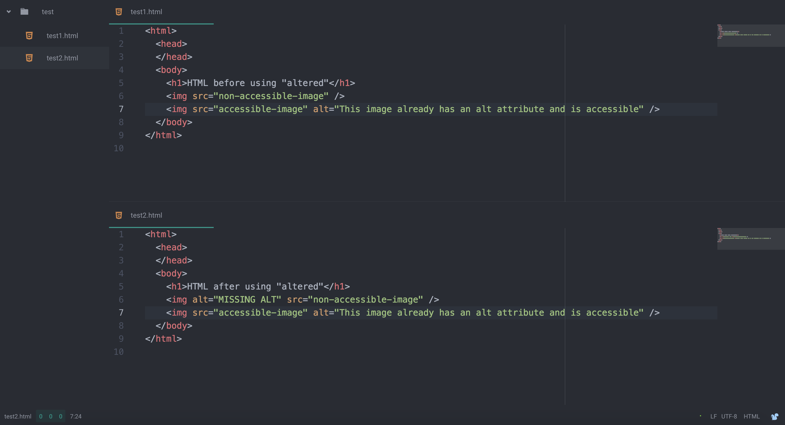

# Altered

Web accessibility is crucial for making the web equal for all. Altered will parse your HTML and add alt attributes to img tags wherever they are missing, thus making the images you post on the web accessible to everyone, even people with screen readers.

# Usage

Once this package is installed just press ctrl-alt-a to run Altered!

